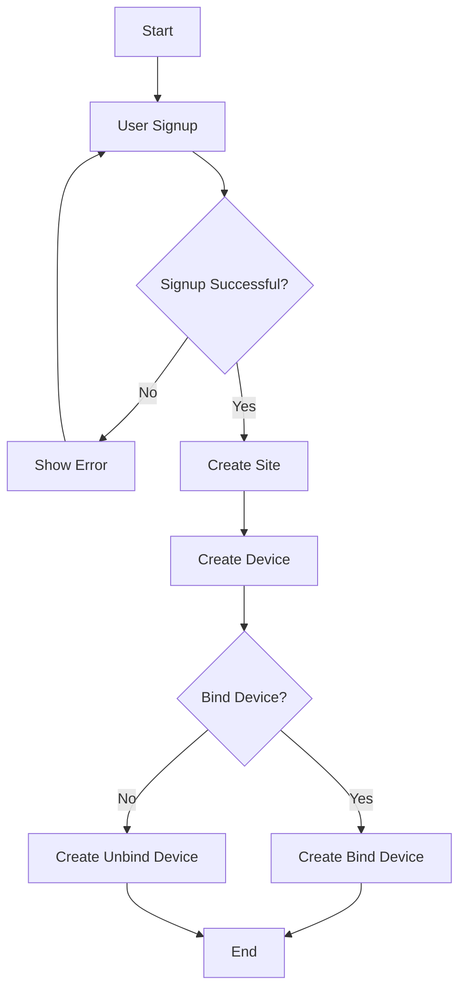
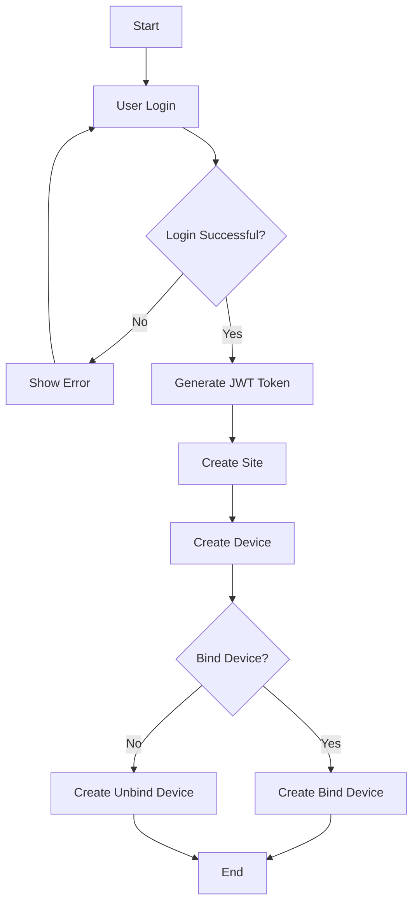
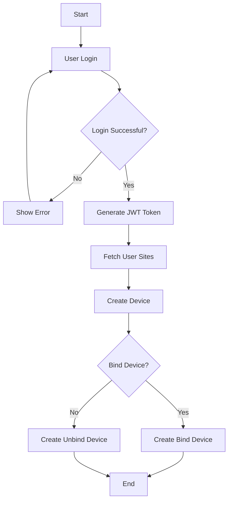

# User Flow Documentation

---

## Entities Overview

The system consists of three main entities:

- **User**
- **Site**
- **Device**

---

### Relationship

- A **User** can have one or more **Sites**
- A **Site** can have one or more **Devices**

---

## Base: API

http://localhost:9000/api

---

## Scenario: 1

### New User (User does not exist)

## **Flow:**

1. User signs up
2. User creates a site
3. User creates a device

## **Steps in Detail:**

### 1. User Registration (Signup)

**API:**
POST /auth/signup

**Request Body:**

```json
{
  "username": "payal14",
  "email": "payal@auranics.com",
  "password": "payal@914",
  "phone": "9454435433",
  "first_name": "payal",
  "last_name": "bhankhodiya",
  "role": "ADMIN"
}
```

**Response:**

```json
{
  "success": true,
  "message": "Success",
  "user": {
    "id": 14,
    "username": "payal14",
    "email": "payal@auranics.com",
    "phone": "9454435433",
    "first_name": "payal",
    "last_name": "bhankhodiya",
    "role": "ADMIN",
    "updatedAt": "2026-03-21T08:37:15.788Z",
    "createdAt": "2026-03-21T08:37:15.788Z"
  }
}
```

### 2. Site Creation

**API:**
POST /admin/sites

**Headers:**
Authorization: JWT

**Request Body:**

```json
{
  "site_id": "SITE00",
  "site_address": "Rajkot",
  "site_type": "xz",
  "site_owner": 14
}
```

**Response:**

```json
{
  "data": {
    "site_uuid": "d1c14d60-e156-4f33-b2c8-cdb6c14d581f",
    "site_devices": [],
    "id": 12,
    "site_id": "SITE00",
    "site_address": "Rajkot",
    "site_type": "xz",
    "site_owner": 14,
    "updatedAt": "2026-03-21T08:39:34.840Z",
    "createdAt": "2026-03-21T08:39:34.840Z"
  }
}
```

### 3. Device Creation

**API:**
POST /admin/devices

**Headers:**
Authorization: JWT


**Request Body:**

```json
{
  "device_id": "ESP32-FA88E4",
  "device_type": "logger",
  "device_name": "xyz",
  "binded": true,
  "binded_to": 14,
  "binded_at": "SITE001"
}
```

**Response:**

```json
{
  "data": {
    "device_uuid": "77e03c3f-72bc-4d8d-aa0e-d8ed9031e66b",
    "id": 32,
    "device_id": "ESP32-FA88E4",
    "device_type": "logger",
    "device_name": "xyz",
    "binded": true,
    "binded_to": 14,
    "binded_at": "SITE001",
    "updatedAt": "2026-03-21T08:42:13.160Z",
    "createdAt": "2026-03-21T08:42:13.160Z"
  }
}
```

---

### Chart:



---

## Scenario: 2

### Existing User without Site

**Flow:**

1. User login
2. User creates a site
3. User creates a device

## **Steps in Detail:**

### 1. User login

**API:**
POST /auth/signin

**Request Body:**

```json
{
  "email": "payal@auranics.com",
  "password": "payal@914"
}
```

**Response:**

```json
{
  "success": true,
  "message": "Success",
  "user": {
    "id": 14,
    "username": "payal14",
    "email": "payal@auranics.com",
    "phone": "9454435433",
    "first_name": "payal",
    "last_name": "bhankhodiya",
    "role": "ADMIN",
    "createdAt": "2026-03-21T08:37:15.788Z",
    "updatedAt": "2026-03-21T08:37:15.788Z"
  }
}
```

### 2. Site Creation

**API:**
POST /admin/sites

**Headers:**
Authorization: JWT <token>

**Request Body:**

```json
{
  "site_id": "SITE00",
  "site_address": "Rajkot",
  "site_type": "xz",
  "site_owner": 14
}
```

**Response:**

```json
{
  "data": {
    "site_uuid": "d1c14d60-e156-4f33-b2c8-cdb6c14d581f",
    "site_devices": [],
    "id": 12,
    "site_id": "SITE00",
    "site_address": "Rajkot",
    "site_type": "xz",
    "site_owner": 14,
    "updatedAt": "2026-03-21T08:39:34.840Z",
    "createdAt": "2026-03-21T08:39:34.840Z"
  }
}
```

### 3. Device Creation

**API:**
POST /admin/devices

**Headers:**
Authorization: JWT <token>

**Request Body:**

```json
{
  "device_id": "ESP32-FA88E4",
  "device_type": "logger",
  "device_name": "xyz",
  "binded": true,
  "binded_to": 14,
  "binded_at": "SITE001"
}
```

**Response:**

```json
{
  "data": {
    "device_uuid": "77e03c3f-72bc-4d8d-aa0e-d8ed9031e66b",
    "id": 32,
    "device_id": "ESP32-FA88E4",
    "device_type": "logger",
    "device_name": "xyz",
    "binded": true,
    "binded_to": 14,
    "binded_at": "SITE001",
    "updatedAt": "2026-03-21T08:42:13.160Z",
    "createdAt": "2026-03-21T08:42:13.160Z"
  }
}
```
---

### Chart:



---

## Scenario: 3

### Existing User with Site

**Flow:**

1. User logs in
2. User selects an existing site
3. User creates a device

## **Steps in Detail:**

### 1. User login

**API:**
POST /auth/signin

**Request Body:**

```json
{
  "email": "payal@auranics.com",
  "password": "payal@914"
}
```

**Response:**

```json
{
  "success": true,
  "message": "Success",
  "user": {
    "id": 14,
    "username": "payal14",
    "email": "payal@auranics.com",
    "phone": "9454435433",
    "first_name": "payal",
    "last_name": "bhankhodiya",
    "role": "ADMIN",
    "createdAt": "2026-03-21T08:37:15.788Z",
    "updatedAt": "2026-03-21T08:37:15.788Z"
  }
}
```

### 2. Site Created Already

### 3. Device Creation

**API:**
POST /admin/devices

**Headers:**
Authorization: JWT

**Request Body:**

```json
{
  "device_id": "ESP32-FA88E4",
  "device_type": "logger",
  "device_name": "xyz",
  "binded": true,
  "binded_to": 14,
  "binded_at": "SITE001"
}
```

**Response:**

```json
{
  "data": {
    "device_uuid": "77e03c3f-72bc-4d8d-aa0e-d8ed9031e66b",
    "id": 32,
    "device_id": "ESP32-FA88E4",
    "device_type": "logger",
    "device_name": "xyz",
    "binded": true,
    "binded_to": 14,
    "binded_at": "SITE001",
    "updatedAt": "2026-03-21T08:42:13.160Z",
    "createdAt": "2026-03-21T08:42:13.160Z"
  }
}
```
---

### Chart:



---

## Device Creation Logic

Device creation has two conditions:

### 1. Bind Device

- Device is linked to a specific user and site
- Required Fields:
  - `user_id` → NOT NULL
  - `site_id` → NOT NULL

**Description:**
A bind device is associated with a particular user and site.

---

### 2. Unbind Device

- Device is not linked to any user or site
- Fields:
  - `user_id` → NULL
  - `site_id` → NULL

**Description:**
An unbind device exists independently and can be assigned later.

---

## Summary Table

| Scenario | User Exists | Site Exists | Action Flow                          |
| -------- | ----------- | ----------- | ------------------------------------ |
| 1        |  No         |  No         | Signup → Create Site → Create Device |
| 2        |  Yes        |  No         | Login → Create Site → Create Device  |
| 3        |  Yes        |  Yes        | Login → Select Site → Create Device  |

---

## Notes

- Device can be created as **bind** or **unbind**
- Binding determines whether the device is linked to a user and site at creation time
